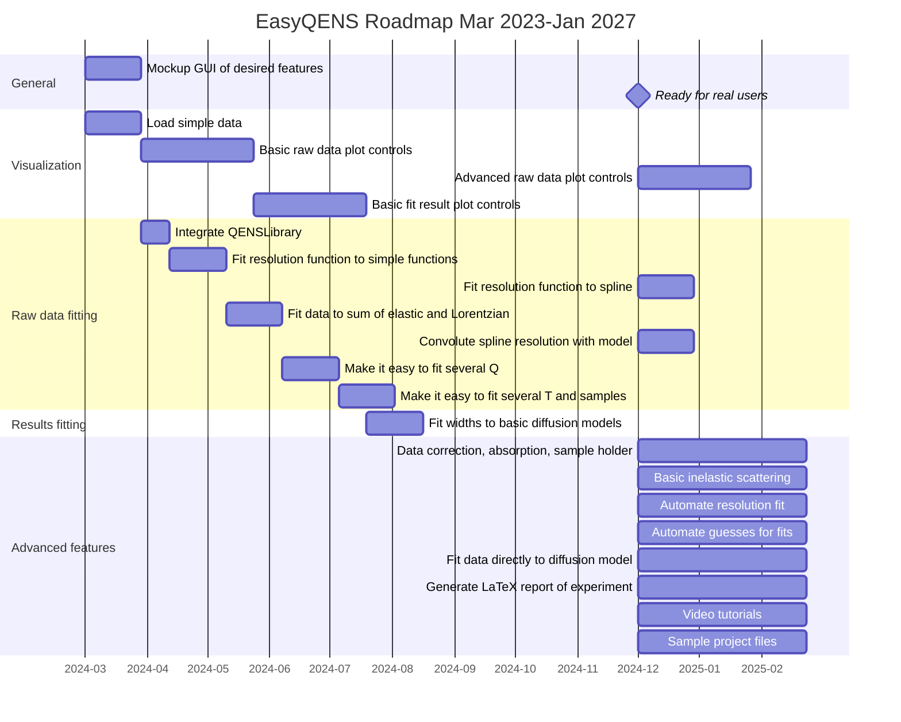

# Roadmap for EasyQENS

This documents the planned roadmap for the EasyQENS project (containing both [EasyQENSApp](https://github.com/easyScience/EasyQENSApp) and [EasyQENSLib](https://github.com/easyScience/EasyQENSLib)) between now and the start of 2027. 
Certain tasks may depend on other Easy-family projects (in particular EasyCore) which will be be noted, where relevant. 

*Note that this chart should only be used to understand the planned features and a vague timeline for EasyQENS development*.

Above we include a Gantt chart showing an early draft of the roadmap. 
Each epic in this chart can be correlated with a heading below which details it. 
In time, each epic will be populated with a series of issues relating to the part of the Easy-family of projects that it pertains to.
Issues that are general to EasyQENS (i.e. those related to interaction with the userbase) will be defined as EasyQENSApp issues.  

## Details 

### General

### Raw data fitting
Functionality to fit the resolution function and raw data convolved with the resolution

### Results fitting
The fit parameters from the raw data fits can be fitted to various models, which is the goal of this epic.

### Video tutorials

Short video tutorials to accompany example projects.
These can be hosted on YouTube or similar and linked to from EasyQENS.org.

### Advanced features
These are features that are not necessary for the first release of EasyQENS, but are desired down the rote. 

### ESS integration

This means integration with the SciCat data catalogue, such that ESS data can be easily loaded to EasyQENS. 
Additionally, it will include the use of `scipp` as a data storage object and `plopp` plotting functionality. 

- [Intraction with SciCat data catalogue](https://github.com/easyScience/EasyReflectometryLib/issues/48)
- [SciCat GUI integration in Experiment pane](https://github.com/easyScience/EasyReflectometryApp/issues/110)
- [Integrate orsopy metadata into scipp object](https://github.com/easyScience/EasyReflectometryLib/issues/49)
- [Use scipp for data storage in the application](https://github.com/easyScience/EasyReflectometryApp/issues/111)
- [Use plopp as a plotting engine in a Jupyter Notebook](https://github.com/easyScience/EasyReflectometryLib/issues/50)
- [Use plopp as a plotting engine in the application](https://github.com/easyScience/EasyReflectometryApp/issues/112)

